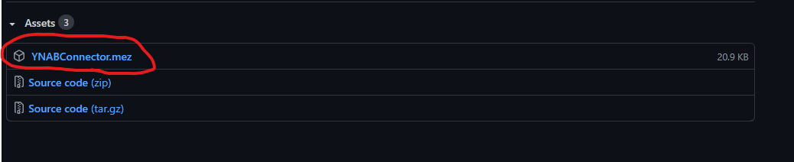
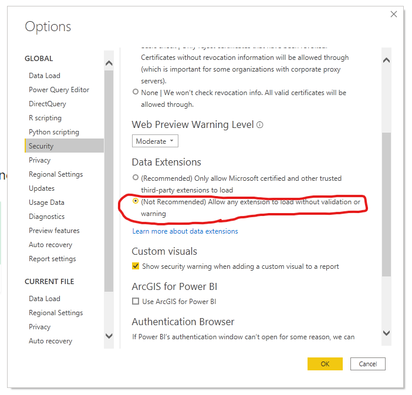
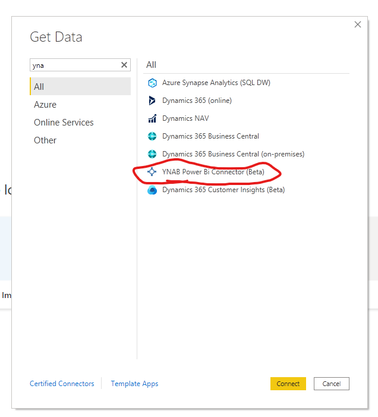
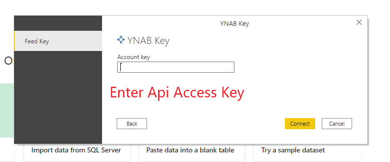

# YNAB (You Need A Budget) Power Bi Connnector

Power Bi Connector to get transactions data from your YNAB budget.

## Prerequisites

Obtain an api access token following [the quick start instructions](https://api.youneedabudget.com/?ref=apilist.fun). *As of now only access token authentication is supported.*

## Installing

* Go to [the releases page](https://github.com/AlahmadiQ8/YNABPowerBiConnector/releases). You'll see a list of releases.
* Download `YNABConnector.mez` from the assets dropdown under the latest release, which would be the top release from the list.

* Place the `YNABConnector.mez` file you dowloaded in under `[Documents]\Microsoft Power BI Desktop\Custom Connectors`
* Open Power Bi Desktop and go to `File -> Options and Settings -> Options -> Security`. Under `Data Extensions` and select `(Not Recommended) Allow any extension to load without validation or warning.

* Restart Power BI Desktop

## Getting Data

## Contributing

TBD